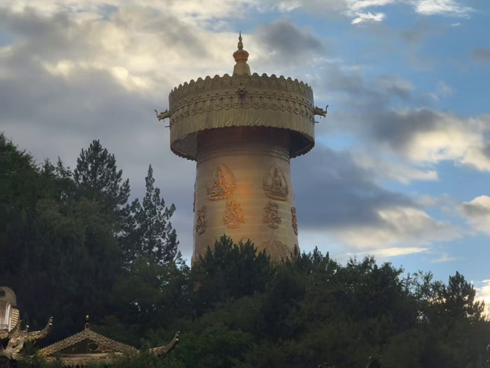
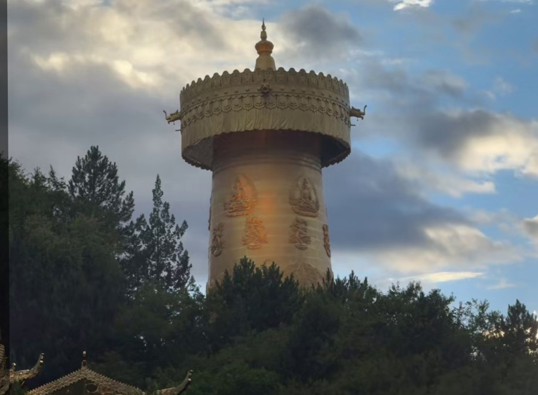

手机 Live Photo 手抖矫正与画质超清增强小工具（借助gemini的帮助）
> 2026 级 物光创新实验室招新作品  
> 作者：齐思铭 | 专业：光电信息科学与工程 | 学号：2026270220 
> 仓库链接：https://github.com/shenren676/LivePhoto-Enhancer
---

 💡 这个项目想解决什么？

平时用手机拍实况照片（Live Photo）或暗光手持连拍，经常遇到两个问题：
1. **暗处全是噪点**：底小光线弱，天空和阴影里全是红绿杂色颗粒。
2. **手抖导致画面微晃**：连拍的十几帧里，每一帧都在微小的位移和倾斜。

苹果系统自带的功能顶多帮你“挑选一张最清楚的作为封面”，剩下的帧就全浪费了。我想做的事情是：不仅要挑出最好的那一帧，还要把其他被晃歪的帧全部“拽回来”对齐，通过多帧叠合，把暗部的杂色噪点直接洗掉。

---

🛠️ 核心思路其实就 3 步

不需要复杂的黑盒神经网络，全靠扎实的计算机视觉几何算法搞定：

1. **自动当裁判（选出基准帧）**  
   用拉普拉斯算子给全视频打分。哪一帧的边缘最硬朗、最清晰，方差就最大，系统自动把它立为“标杆”。
2. **侦探办案（特征匹配与强行扭正）**  
   利用 SIFT 算法在建筑物上找标志性角点并办好“数字身份证”。算出每一帧手抖偏了多少，再用单应性矩阵（Homography）把拍歪的画面强行拉回原位，严丝合缝扣在标杆上。
3. **取中位数洗噪点（时域融合）**  
   多张图对齐后，真实建筑物在同一个像素点上颜色是不变的，而跳动的噪点要么偏亮、要么偏暗。同一位置直接取中位数（Median），噪点被瞬间物理抹平。

---

开发中我所遇到的几个问题

这是在写代码时真正遇到的两个大问题，全部独立调试解决：

 坑 1：随风晃动的树叶，把整栋楼带歪了
问题**：视频里除了静止的建筑物，还有被风吹动的树叶和飘走的云。匹配特征点时，树叶的位移方向和建筑物完全相反，导致算法把整栋楼算得重影歪斜。
解决**：在求解矩阵时引入了 **RANSAC（随机抽样一致）** 算法。它就像少数服从多数的投票，能自动把乱晃的树叶和云识别成“捣乱的假数据”直接开除，只用静止的建筑物来算坐标，彻底解决了重影。

 坑 2：画面左侧出现了一条突兀的暗带分界线
问题**：成片出来后，发现最左侧有一道很明显的垂直暗斑。仔细排查后发现：因为手抖往右晃，算法把图像向左拉伸时边缘产生了没有画面的“真空黑区”（像素值为 0）。取中位数时，这帮 0 把左侧边缘的平均亮度拉低了。
解决**：借鉴了手机电子防抖（EIS）的做法，在代码最后加上自动切边机制（Border Crop），直接切掉外圈 30 像素的拉伸过渡带，整张成片立刻干净规整。

---

📷 最终效果对比

| 原始最清晰单帧 (`best_frame.jpg`) | 10 帧对齐去噪成片 (`enhanced_result.jpg`) |
| :---: | :---: |
|  |  |

> **肉眼可见的变化**：天空和暗处的沙粒感杂色噪点被完全抹平，转经筒顶端的龙角、金顶尖端和飞檐瓦片线条依旧坚硬锐利，没有丝毫重影虚边。

开发的过程
首先我灵感起源于一张手抖的实况照片 苹果自带的机制却选出了一张令我满意的封面 随后我自学了黑马程序员的python入门教程函数方法列表等基础语法 再借助gemini将整个框架编写出来 我再去理解代码 但有一些复杂的算法其中的数学原理和计算机视觉我还理解不了（初版非常复杂，这已经是我简化过的了）   
