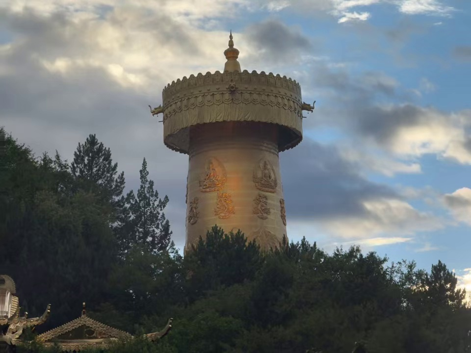
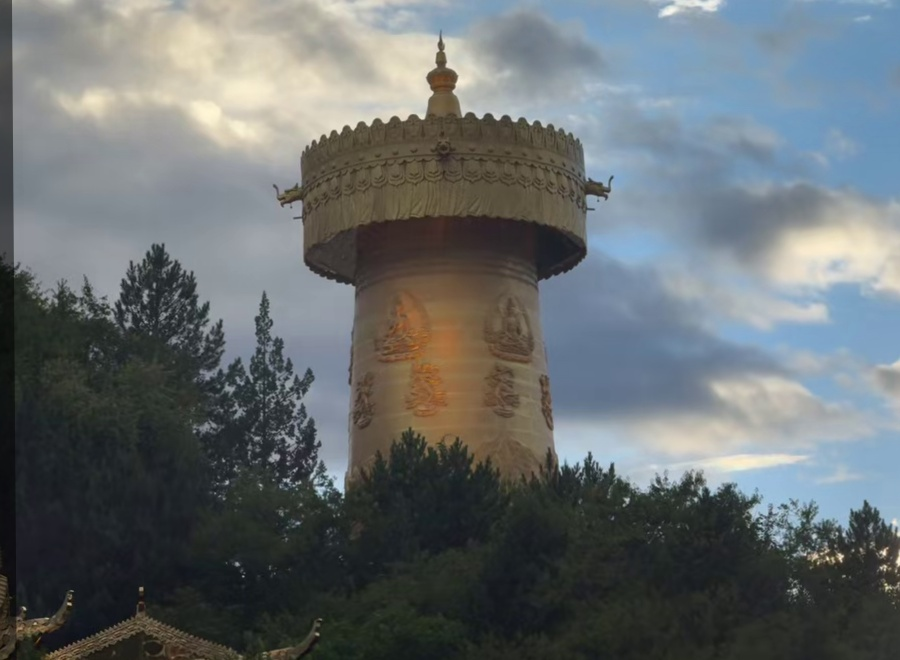

LivePhoto-Enhancer：从实况照片视频中提取并融合清晰画面

2026 年物光创新实验室招新作品 · 齐思铭 · 光电信息科学与工程 2026 级  
项目仓库：[shenren676/LivePhoto-Enhancer](https://github.com/shenren676/LivePhoto-Enhancer)

## 我想解决的问题

一次手持拍摄中，手机从实况照片里选出的封面不一定是我最喜欢的画面。我想试试：能否从一段短视频中自己挑出较清晰的一帧，再利用相邻帧中重复出现的画面信息，减少暗部噪点？

目前的程序把 `test.mp4` 当作输入，输出两张静态图片：挑选出的基准帧 `best_frame.jpg`，以及对齐、融合和裁边后的 `enhanced_result.jpg`。它处理的是实况照片中可导出的视频部分或普通短视频文件；目前尚未直接读取、编辑或重新生成手机的 Live Photo 文件。

## 处理过程

1. **选基准帧。** 逐帧读取视频，计算每帧灰度图的拉普拉斯方差。取分数最高的一帧作为基准，并保存为 `best_frame.jpg`。这个分数衡量图像边缘变化，不能保证它在任何场景下都恰好是主观上最好的照片。
2. **对齐其他帧。** 从分数靠前的其余帧中最多取 9 帧，用 SIFT 提取特征，进行双近邻匹配和比值筛选。匹配点足够时，用 RANSAC 估计单应性矩阵，将该帧变换到基准帧的坐标；无法求出矩阵的帧会跳过。
3. **融合并裁边。** 对成功对齐的帧和基准帧，逐像素取中位数，尝试减弱帧间变化的噪点。最后从四边各裁去 30 像素，保存为 `enhanced_result.jpg`。实际参与融合的帧数以程序输出为准，最多为 10 帧。

输入为固定机位或轻微手抖、主体较静止的短视频时，这个思路更容易奏效。大幅运动、前景移动、缺少可匹配特征或透视变换后的黑边，仍可能造成重影或暗带；固定裁边也不一定能去净所有边缘伪影。当前程序没有做超分辨率重建，输出图像还会因裁边而变小。

## 如何运行

需要 Python，以及 `requirements.txt` 中的 `opencv-python` 和 `numpy`。在项目文件夹里运行：

```bash
python -m pip install -r requirements.txt
python main_test.py
```

程序目前固定读取同目录的 `test.mp4`。换视频时，将新视频命名为 `test.mp4` 放在这里，或修改 `main_test.py` 中 `cv2.VideoCapture("test.mp4")` 的文件名。运行会写入或覆盖同目录的 `best_frame.jpg`、`enhanced_result.jpg`。建议先用几秒钟的短视频尝试，因为程序会把视频帧读入内存。

项目文件：`main_test.py` 是可运行的处理脚本；`test.mp4` 是示例输入；两张 JPG 是该示例的输出。

## 示例结果

下图对应仓库中的 `test.mp4`。这次运行选出一张 960 × 720 的基准帧，融合了共 10 帧，裁边后的结果为 900 × 660。对照时请注意：两张图的画面范围不同，不能直接拿文件大小或像素数判断画质提升。

| 视频中选出的基准帧 | 对齐融合并裁边后的结果 |
| :---: | :---: |
|  |  |

## 开发过程与后续改进

这个想法来自一张手抖的实况照片。开始做时，我先学习了 Python 的函数、列表等基础语法，再借助 Gemini 生成初版框架，逐步阅读和简化代码，并用自己的视频观察输出。项目让我开始接触图像清晰度评价、特征匹配、几何对齐和多帧融合，也让我意识到仅靠一张成片的观感，不能证明所有视频都能改善。

当前版本使用 RANSAC 来减弱误匹配对几何估计的影响，使用固定裁边处理变换后出现的边缘区域。不过示例结果的左侧仍可见暗带。下一步我想尝试根据各帧有效像素区域决定裁剪范围，并设计更多场景的对比测试，记录失败情况。

本项目使用了 AI 辅助生成初版代码；问题选择、素材测试、结果检查和这份说明由我完成。对其中较复杂的数学和计算机视觉原理，我仍在继续学习。

## 依赖与参考资料

- [OpenCV：SIFT 特征匹配与比值筛选](https://docs.opencv.org/4.x/dc/dc3/tutorial_py_matcher.html)
- [OpenCV：特征匹配、单应性与 RANSAC](https://docs.opencv.org/4.x/d1/de0/tutorial_py_feature_homography.html)
- [NumPy：`median`](https://numpy.org/doc/stable/reference/generated/numpy.median.html)

第三方库按各自的许可证使用。
